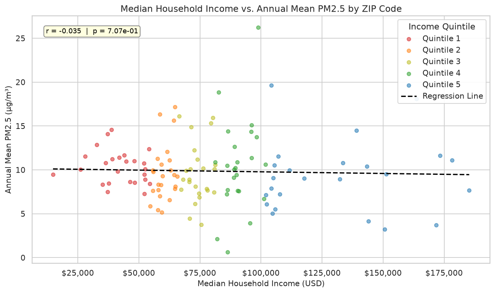
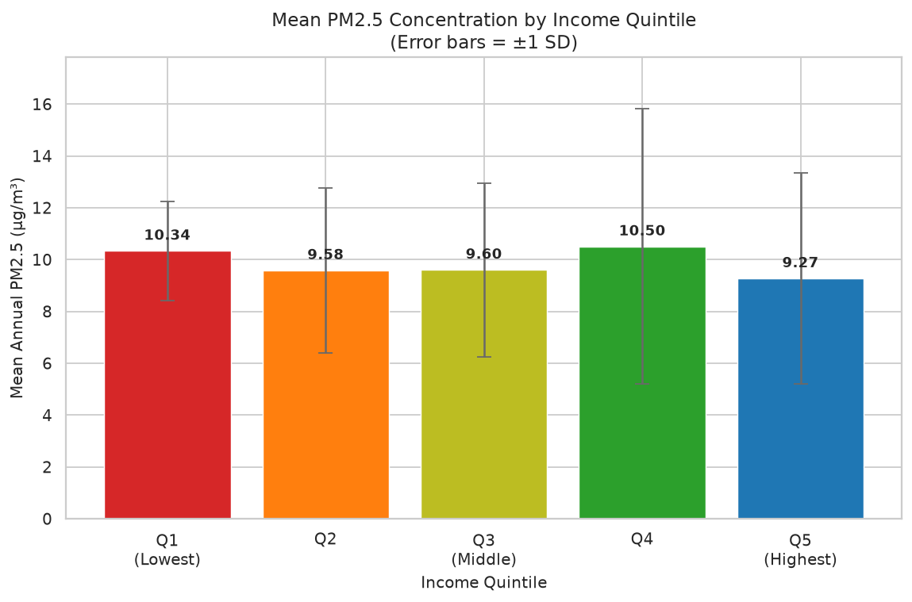
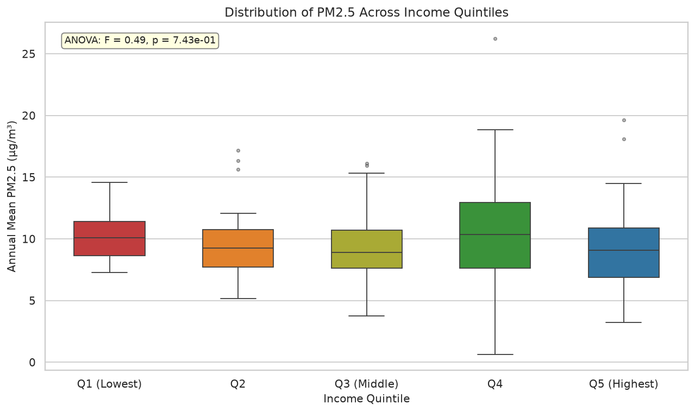
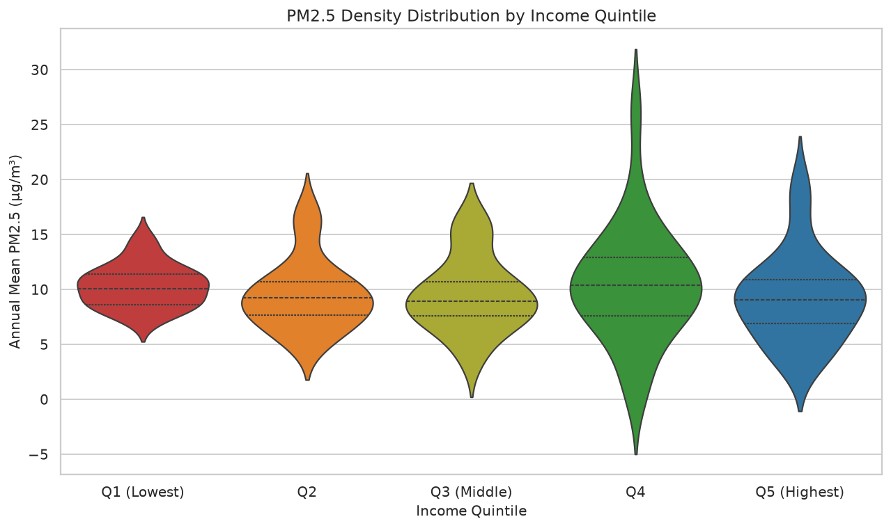
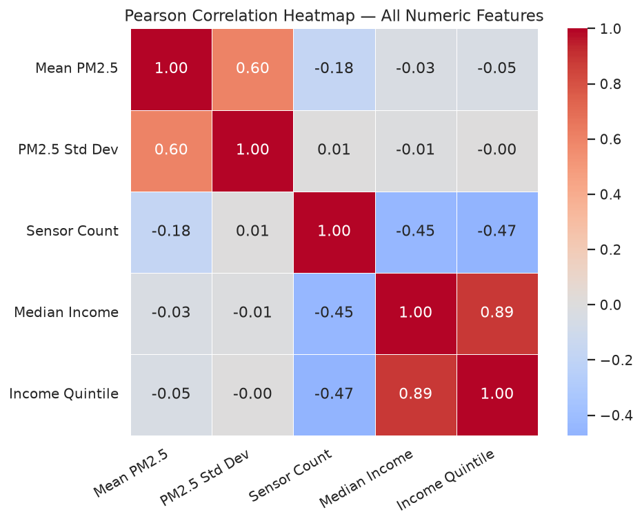
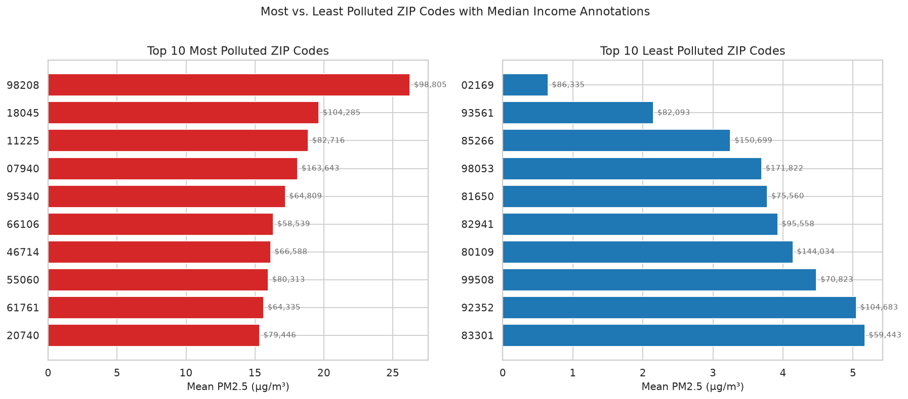
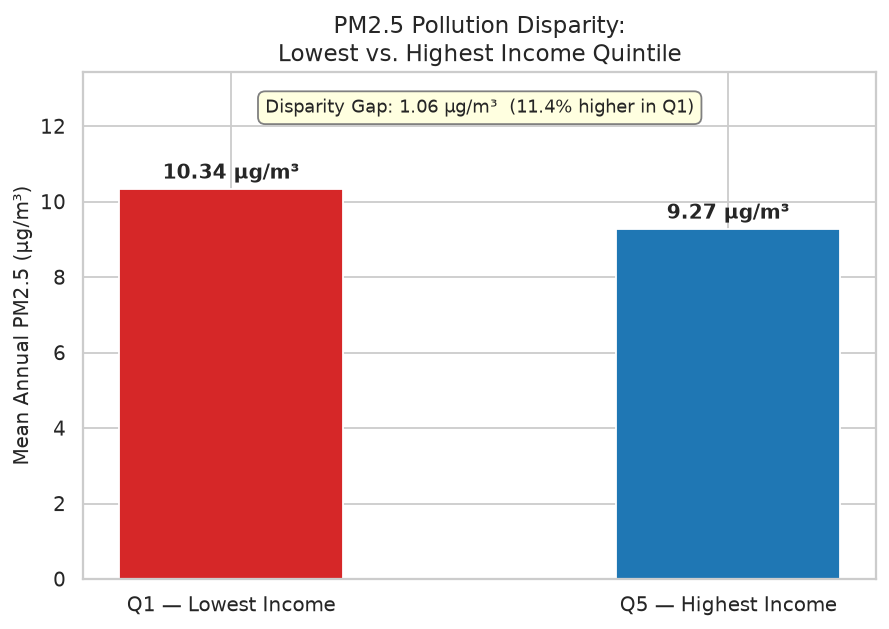

# Urban Pollutant Exposure

Does household income predict exposure to air pollution across US ZIP codes? This project pulls real-time air quality data and Census income data to test that question statistically.

## Motivation

Environmental justice research often argues that lower-income communities bear a disproportionate burden of air pollution. This project tests that hypothesis directly using open data — PM2.5 (fine particulate matter) readings from air quality monitoring stations, matched against median household income by ZIP code.

## Data Sources

- **Air quality**: [OpenAQ API v3](https://docs.openaq.org/) — PM2.5 measurements from US monitoring stations, daily averages, Jan 2023–Jan 2024
- **Income**: [US Census Bureau ACS 5-Year Estimates](https://www.census.gov/programs-surveys/acs), table B19013 (Median Household Income), by ZIP Code Tabulation Area

## Methodology

1. Fetch all active US PM2.5 monitoring stations from OpenAQ, pull each station's daily PM2.5 averages for a 1-year window.
2. Reverse-geocode each station's coordinates to a ZIP code (via Nominatim/OpenStreetMap).
3. Aggregate PM2.5 to ZIP-code level (mean, std, sensor count).
4. Merge with Census median household income by ZIP.
5. Split ZIP codes into income quintiles (Q1 = lowest income, Q5 = highest).
6. Test the relationship with Pearson correlation and one-way ANOVA across quintiles.

## Key Findings

Across the **121 ZIP codes** with both valid pollution and income data:

| Test | Statistic | p-value | Result |
|---|---|---|---|
| Pearson correlation (income vs. PM2.5) | r = -0.0345 | p = 0.707 | Not statistically significant |
| One-way ANOVA (PM2.5 across income quintiles) | F = 0.490 | p = 0.743 | No significant difference between quintiles |

**No statistically significant relationship was found** between median household income and PM2.5 exposure in this sample. Mean PM2.5 by quintile ranged narrowly from 9.27 µg/m³ (Q5, highest income) to 10.50 µg/m³ (Q4) — differences well within the range of natural variation (± 1 SD per group is 2–5 µg/m³).




**Caveats:** this is a modest sample (121 ZIP codes, limited by OpenAQ station coverage and successful geocoding), a single one-year window, and PM2.5 only — it does not capture other pollutants, indoor air quality, or proximity to specific pollution sources (highways, industrial sites) that more localized studies often find correlated with income. A null result at this scale doesn't rule out disparities that might appear with denser station coverage, a longer time series, or pollutant-specific analysis.

<details>
<summary>Additional charts</summary>







</details>

## Tech Stack

- Python 3.13
- pandas, numpy — data wrangling
- scipy — statistical tests (Pearson correlation, ANOVA)
- matplotlib, seaborn — visualization
- geopy (Nominatim) — reverse geocoding
- requests — API calls
- python-dotenv — environment/secrets management

## Setup

```bash
git clone https://github.com/bruvisrekt/UrbanPollutantExposure.git
cd UrbanPollutantExposure/urban_pollutant_exposure

python3 -m venv venv
source venv/bin/activate
pip install -r requirements.txt
```

Create a `.env` file in this folder (see `.env.example`) with:
```
OPENAQ_API_KEY=your_openaq_key
```
Get a free key at [explore.openaq.org/register](https://explore.openaq.org/register).

Download median household income data (ACS table B19013, ZCTA level) from [data.census.gov](https://data.census.gov) or the Census API, save as `acs_median_income_by_zip.csv` in this folder.

Run the notebook:
```bash
jupyter notebook urban_pollution_analysis.ipynb
```

## Data Notes

- The OpenAQ fetch queries every active US PM2.5 station individually and can take several minutes; a threaded version is used to parallelize requests.
- Reverse geocoding respects Nominatim's usage policy (1 request/second) and is **not** parallelized.
- Final dataset size is smaller than the raw pull, since only ZIP codes with both a successfully geocoded station and a matching Census income record survive the merge.

## License

GPL-3.0 — see [LICENSE](LICENSE).
